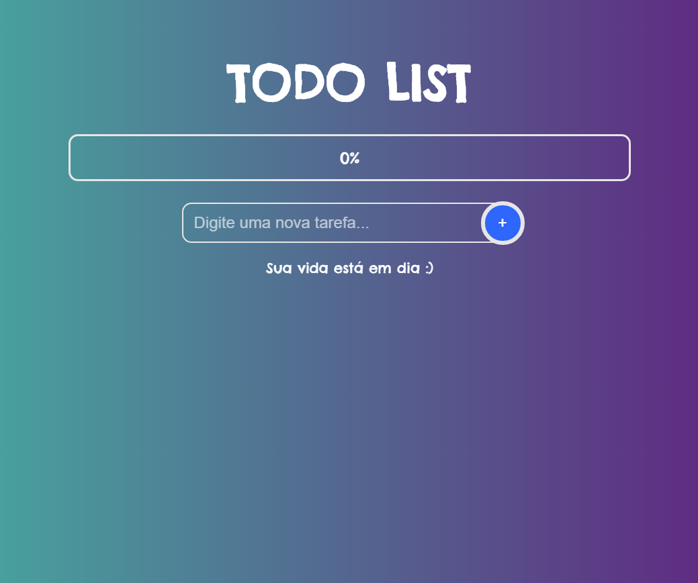

# Simple Todo list



## Build With

- [Vue](https://vuejs.org)
- [Express](https://expressjs.com)
- [PostgreSQL](https://www.google.com/search?client=opera&q=PostgreSQL&sourceid=opera&ie=UTF-8&oe=UTF-8)

## Instalação

Rodando servidor backend:

```
cd frontend
npm install
npm run dev
```

E depois inciando localhost frontend:

```
cd backend
npm install
npm run serve
```

## License

Distribuído sob a licença MIT. Veja LICENSE.md para mais informações.
